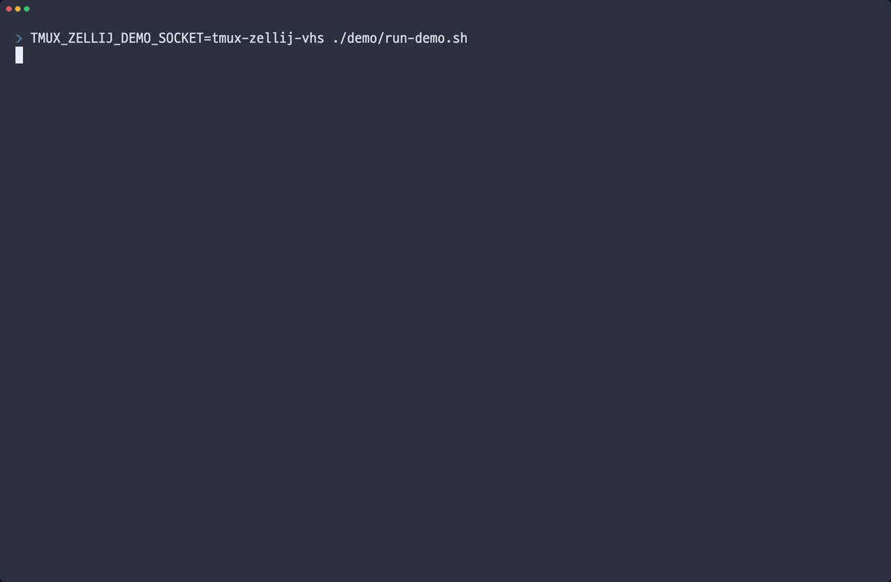

# tmux-zellij-style

`tmux` configuration that keeps stock tmux intact and adds a more `zellij`-like, mode-first workflow on top.

If you like tmux's stability but prefer zellij's "enter a mode, then do a thing" interaction model, this repo is the middle ground.

## Why (the hell) this exists

This setup is built around one idea:

- keep tmux as the core
- make common actions easier to discover and remember

Instead of relying only on raw prefix bindings, you mostly think like this:

- `Ctrl-g` -> open launcher
- `p / t / r / s / m / o` -> choose pane, tab, resize, scroll, move, or session
- one more key -> run the action

`Ctrl-b` still works as the normal tmux prefix. Nothing is replaced; this just adds a cleaner top layer.

## Highlights

- `Ctrl-g` launcher for pane, tab, resize, scroll, move, and session flows
- `Ctrl-b` preserved as the default tmux escape hatch
- fast global pane movement with `Ctrl-Alt-h/j/k/l` and arrow-key variants
- theme files separated from the main keymap
- built-in popup hints via `Ctrl-g ?`
- full manuals in both Korean and English

## Demo



## Install

Clone into the default XDG tmux config path:

```bash
git clone https://github.com/j3bit/tmux-zellij-style.git ~/.config/tmux
```

Reload from an existing tmux session:

```bash
tmux source-file ~/.config/tmux/tmux.conf
```

If you manage tmux inside a dotfiles repo, clone it anywhere and symlink it:

```bash
git clone https://github.com/j3bit/tmux-zellij-style.git ~/path/to/tmux-zellij-style
mkdir -p ~/.config
ln -sfn ~/path/to/tmux-zellij-style ~/.config/tmux
```

## Requirements

- Recommended: tmux `3.2+`
- Reason: tmux `3.2` added support for `~/.config/tmux/tmux.conf`

For tmux `< 3.2`, use the legacy path:

```bash
ln -sfn ~/.config/tmux/tmux.conf ~/.tmux.conf
```

Avoid maintaining different contents in both `~/.tmux.conf` and `~/.config/tmux/tmux.conf` at the same time.

## Quick Start

Try these in order:

1. Split right: `Ctrl-g p r`
2. Split down: `Ctrl-g p d`
3. Move between panes: `Ctrl-g p h/j/k/l`
4. Open a new tab: `Ctrl-g t n`
5. Resize a pane: `Ctrl-g r h/j/k/l`
6. Copy from scrollback: `Ctrl-g s`, then `v`, then `y`

If that already feels more natural than stock tmux, the config is doing its job.

## Core Keys

| Key | What it does |
| --- | --- |
| `Ctrl-g` | Open the launcher |
| `Ctrl-b` | Use normal tmux bindings |
| `Ctrl-g ?` | Open popup key hints |
| `Ctrl-g q` | Detach current client |
| `Ctrl-g Q` | Kill current session with confirmation |
| `Ctrl-g o r` | Reload `tmux.conf` |

## Modes

After pressing `Ctrl-g`, use:

- `p` for pane actions
- `t` for tab/window actions
- `r` for resizing
- `s` for scroll and copy mode
- `m` for pane movement/layout changes
- `o` for session actions

The active key table is shown in the status bar, so you can always see which mode you are in.

## Themes

Behavior lives in [`tmux.conf`](tmux.conf). Color styling lives in [`theme/`](theme).

Included themes:

- `catppuccin-latte`
- `catppuccin-mocha`
- `dracula`
- `gruvbox-dark`
- `nord`
- `one-half-dark`
- `one-half-light`
- `solarized-dark`

Theme loading works like this:

- if `~/.config/tmux/theme/current.conf` exists, load it
- otherwise fall back to `~/.config/tmux/theme/one-half-dark.conf`

Example:

```bash
ln -sf ~/.config/tmux/theme/dracula.conf ~/.config/tmux/theme/current.conf
tmux source-file ~/.config/tmux/tmux.conf
```

## Files

- [tmux.conf](tmux.conf): main configuration
- [tmux_conf_kr.md](tmux_conf_kr.md): Korean manual
- [tmux_conf_en.md](tmux_conf_en.md): English manual
- [tmux_keys.txt](tmux_keys.txt): popup key hints
- [theme/](theme): theme definitions

## Limitations

- This is not a full zellij clone.
- `tmux` cannot reproduce floating panes, pinned panes, or zellij's richer UI model.
- Some `Ctrl-Alt-*` bindings depend on terminal emulator support.

## Thanks To

This project exists because of two excellent upstream tools:

- [`tmux`](https://github.com/tmux/tmux) for the stable, scriptable, dependable core
- [`zellij`](https://github.com/zellij-org/zellij) for the mode-first interaction model that inspired this setup

If you want the original experiences, both projects are worth using directly.
